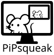

A tiny, borderless picture-in-picture window that mirrors one of your
monitors live, for Linux/Wayland. Drag it anywhere, keep it floating
above everything else, and glance at a second screen without dedicating
a whole monitor (or workspace) to it.

- **Borderless & floating** - no titlebar, stays floating even on tiling
  window managers
- **Live monitor mirror** - via the standard xdg-desktop-portal
  ScreenCast portal, so it works the same across compositors
- **Keyboard-driven** - `+`/`-` to resize, `Tab` to switch monitor,
  click-drag to move

## Install

**Flatpak** (recommended): submission to Flathub is in progress
([flathub/flathub#10356](https://github.com/flathub/flathub/pull/10356)).
Until it's merged, build the flatpak locally:

```sh
flatpak-builder --user --force-clean --repo=repo build-dir \
  io.github.teacher_svb.pipsqueak.yml
flatpak --user remote-add --if-not-exists --no-gpg-verify \
  pipsqueak-local-repo ./repo
flatpak --user install pipsqueak-local-repo io.github.teacher_svb.pipsqueak
flatpak run io.github.teacher_svb.pipsqueak
```

## Usage

| Action | Shortcut |
| --- | --- |
| Move the window | click and drag anywhere on it |
| Resize | `+` / `-` (steps through a few fixed sizes) |
| Switch monitor | `Tab` |
| Quit | close the window |

The first run opens the portal's monitor picker. Your choice is
remembered (`$XDG_STATE_HOME/pipsqueak/`, falling back to
`~/.local/state/pipsqueak/`), so later runs skip straight to streaming.

## Building from source

Requires Rust (edition 2021+) and the Wayland, xkbcommon, PipeWire, and
D-Bus development headers (`libwayland-dev`, `libxkbcommon-dev`,
`libpipewire-0.3-dev`, `libspa-0.2-dev`, `libdbus-1-dev`, or your
distro's equivalents), plus a C toolchain and `clang`/`libclang` for the
PipeWire bindings.

```sh
cargo build --release
./target/release/pipsqueak
```

No Rust toolchain handy, or don't want to install one system-wide?
`.devcontainer/` has a Dockerfile with everything needed to *build*
the project - see the comments there for the exact commands. Run the
resulting binary on the host either way, though: it needs your desktop
session's Wayland/PipeWire/D-Bus, which a container doesn't have.

## License

GPL-3.0-or-later - see [LICENSE](LICENSE).
